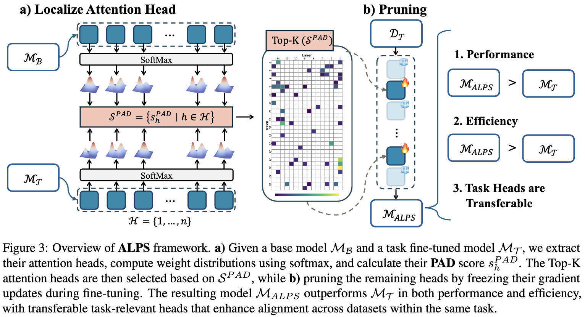

# ALPS

> **Repository Status:** This repository currently contains the attention head selection implementation of ALPS. The training code will be released in a future version due to ongoing research submissions.

**ALPS (Attention Localization and Pruning Strategy)** is a novel PEFT method for efficiently aligning large language models by identifying and pruning attention heads that are less relevant to downstream tasks. This approach reduces computational and memory overhead while maintaining or even improving model performance.



## Installation

```bash
pip install torch transformers numpy matplotlib seaborn scipy pyyaml
```

## Quick Start

Edit `ALPS/config.yaml` to specify your models:

```yaml
models:
  base_model: "Qwen/Qwen2.5-7B-Instruct"
  task_model: "Qwen/Qwen2.5-Coder-7B-Instruct"
```

Run the analysis:

```bash
cd ALPS
python run_alps.py --config config.yaml
```

## Output

The analysis generates:
- **Heatmap visualization** showing task-sensitive attention heads across layers
- **Sensitivity scores** for each attention head
- **Top-k most sensitive heads** for pruning candidates
- **Statistical summary** of the analysis

## Supported Distance Metrics

- `wasserstein_normalized`: Normalized Wasserstein distance (default)
- `wasserstein`: Original Wasserstein distance  
- `kl_divergence`: KL divergence
- `js_divergence`: Jensen-Shannon divergence
- `cosine_similarity`: Cosine distance

## Citation

If you use this code in your research, please consider citing our paper as:
```
@article{chen2025alps,
  title={ALPS: Attention Localization and Pruning Strategy for Efficient Alignment of Large Language Models},
  author={Chen, Hao and Li, Haoze and Xiao, Zhiqing and Gao, Lirong and Zhang, Qi and Hu, Xiaomeng and Wang, Ningtao and Fu, Xing and Zhao, Junbo},
  journal={arXiv preprint arXiv:2505.18799},
  year={2025}
}
```

